# NutriLens AI Diet Planner — Complete Technical Report

> **Document Type:** System Analysis & Research Documentation  
> **Version:** 2.6 | **Date:** April 2026  
> **Authors:** Divyansh Tyagi  
> **System:** NutriLens — AI-Powered Personalized Diet Planning Platform

---

## Table of Contents

| # | Section | Part |
|---|---------|------|
| 1 | System Architecture | Part 1 |
| 2 | AI & ML Components Classification | Part 1 |
| 3 | NLP Pipeline (Detailed) | Part 1 |
| 4 | Hybrid Matching Engine | Part 1 |
| 5 | Meal Plan Generator | Part 2 |
| 6 | Macro Optimization Engine | Part 2 |
| 7 | KNN Recommendation System | Part 2 |
| 8 | Data Structures & Schema | Part 2 |
| 9 | Frontend Architecture | Part 2 |
| 10 | End-to-End Flow | Part 2 |
| 11 | Innovation & Uniqueness | Part 2 |
| 12 | Limitations & Future Work | Part 2 |

---

## 1. SYSTEM ARCHITECTURE

### 1.1 High-Level Design

NutriLens is a three-tier client-server system consisting of a **Flutter mobile frontend**, a **Flask REST API backend**, and **Google Cloud Firestore** as the persistence layer. The backend hosts all AI/ML components in-process (no external ML service), enabling sub-second inference latency.

```mermaid
graph TB
    subgraph "Mobile Client (Flutter)"
        UI["UI Layer<br/>DietTab · LoggingTab · TrackerTab · AccountTab"]
        DP["DataProvider<br/>(ChangeNotifier)"]
        API["ApiService<br/>(HTTP Client)"]
    end

    subgraph "Backend (Flask + Gunicorn)"
        Routes["Route Layer<br/>meal_routes · auth_routes · tracker_routes"]
        Services["Service Layer<br/>MealGeneratorService · MealLoggingService"]
        AI["AI Engine<br/>NLP Pipeline · Meal Plan Generator · Macro Optimizer · KNN"]
        Repos["Repository Layer<br/>meal_repo · user_repo · tracker_repo"]
    end

    subgraph "Cloud Infrastructure"
        FS["Google Cloud Firestore"]
        FA["Firebase Auth"]
        CR["Cloud Run / Render"]
    end

    UI --> DP --> API
    API -->|"HTTPS REST"| Routes
    Routes --> Services --> AI
    Services --> Repos --> FS
    API -->|"ID Token"| FA
    CR -->|"Hosts"| Routes
```



### 1.2 Backend Layered Architecture

The backend follows a **Repository-Service-Route** pattern:

| Layer | Files | Responsibility |
|-------|-------|----------------|
| **Routes** | `meal_routes.py`, `auth_routes.py`, `tracker_routes.py` | HTTP endpoint handling, request validation, response serialization |
| **Services** | `meal_generator_service.py`, `meal_logging_service.py` | Business logic orchestration, multi-step workflows |
| **AI Engine** | `nlp_pipeline.py`, `hybrid_matcher.py`, `meal_plan_generator.py`, `macro_optimizer.py`, `smart_swap_knn.py` | All ML/AI inference and optimization |
| **Repositories** | `meal_repository.py`, `user_repository.py`, `tracker_repository.py` | Firestore CRUD abstraction |
| **Utils** | `diet_utils.py`, `calorie_utils.py`, `cache_utils.py` | Shared helpers: dietary filtering, caching, target calculation |

### 1.3 Request-Response Lifecycle

1. **Flutter** sends an authenticated HTTP POST (Firebase ID token in header)
2. **Flask route** validates the token via `firebase_auth_optional` middleware
3. **Route** validates request payload via `validators/`
4. **Service** orchestrates the business logic (e.g., fetching user profile, calling AI engine)
5. **AI Engine** performs inference (NLP matching, plan generation, optimization)
6. **Repository** reads/writes Firestore documents
7. **Response** is serialized via `response_utils.py` and returned as JSON

### 1.4 Startup Initialization

At server cold start (`app.py`), the following happens sequentially:

1. Firebase Admin SDK initialized with service account credentials
2. **Meals cache** loaded from Firestore into `MEALS_CACHE` (global in-memory list)
3. **NLP Pipeline** initialized: vocabulary built, TF-IDF vectors computed, phrase detector loaded
4. **KNN model** loaded from `models/knn_meal_swap.joblib`
5. All Flask blueprints registered

This ensures **zero Firestore reads during inference** — all meal data lives in memory.

---

## 2. AI & ML COMPONENTS — CLASSIFICATION

### 2.1 Complete AI Taxonomy

| Component | AI Category | Technique | Location |
|-----------|-------------|-----------|----------|
| TF-IDF Vectorizer | **NLP / Information Retrieval** | Term Frequency-Inverse Document Frequency with cosine similarity | `ai/tfidf_matcher.py` |
| Fuzzy String Matching | **NLP / Approximate Matching** | Levenshtein distance via `rapidfuzz.fuzz.partial_ratio` | `ai/hybrid_matcher.py` |
| Spelling Correction | **NLP / Error Correction** | Fuzzy matching against food vocabulary | `ai/text_preprocessor.py` |
| Alias Normalization | **NLP / Entity Resolution** | Dictionary-based regional-to-canonical mapping (120+ aliases) | `ai/text_preprocessor.py` |
| Context Resolution | **NLP / Intent Recognition** | Rule-based food combination detection with tiered boosting | `ai/context_resolver.py` |
| Food Category Classifier | **Machine Learning** | Trained classifier (joblib model, predict_proba) | `ai/food_category_model.py` |
| Hybrid Scoring Engine | **Heuristic AI** | 5-signal weighted formula with adaptive penalties | `ai/hybrid_matcher.py` |
| KNN Meal Replacement | **Machine Learning / Recommendation** | K-Nearest Neighbors in standardized macro feature space | `ai/smart_swap_knn.py` |
| Meal Plan Generator | **Heuristic AI / Constraint Satisfaction** | Pattern-based generation with multi-signal candidate scoring | `ai/meal_plan_generator.py` |
| Macro Optimizer | **Heuristic Optimization** | Iterative adjustment loop with decaying delta and early stopping | `utils/macro_optimizer.py` |
| Compatibility Scorer | **Knowledge-Based AI** | Pair-wise culinary rule engine | `ai/compatibility_scorer.py` |
| Target Calculator | **Mathematical Model** | Mifflin-St Jeor BMR + TDEE + calorie banking | `ai/target_calculator.py` |
| Quantity Extractor | **NLP / Named Entity Recognition** | Pattern-based numeric entity extraction | `ai/quantity_extractor.py` |
| Phrase Detector | **NLP / Chunking** | N-gram phrase detection (up to 4-word) | `ai/phrase_detector.py` |

### 2.2 Why These Are AI Techniques

**TF-IDF + Cosine Similarity** is a foundational Information Retrieval technique. It converts text into high-dimensional sparse vectors where each dimension represents a term's importance (TF) relative to the corpus (IDF). Cosine similarity then measures semantic closeness between query and document vectors in this space. This is machine learning because the vectorizer *learns* term weights from the meal corpus.

**Fuzzy Matching** uses edit distance algorithms (Levenshtein) to compute string similarity, handling misspellings and phonetic variations. The `partial_ratio` scorer finds the best substring alignment, making it robust to partial input.

**K-Nearest Neighbors** is a supervised/unsupervised ML algorithm that finds the k most similar data points in a feature space. Here, meals are projected into a 4D nutritional space (calories, protein, carbs, fat), standardized via `StandardScaler`, and neighbors are found using Euclidean distance.

**Heuristic Optimization** (the macro optimizer) is a form of AI search where the system iteratively adjusts portion quantities to minimize a weighted error function, using strategies like decaying step size (simulated annealing-inspired), early stopping, and best-solution tracking.

---

## 3. NLP PIPELINE — DETAILED ANALYSIS

### 3.1 Architecture Overview

The NLP pipeline (`ai/nlp_pipeline.py`) is a **12-step hybrid processing chain** that transforms raw user text into structured meal log entries with nutritional data.


### 3.2 Step-by-Step Execution

#### Step 0: Multi-Item Splitting
**Input:** `"2 roti + aloo sabzi"`  
**Logic:** Splits on `+`, `,` (not followed by digit), `and`, `aur` using regex  
**Output:** `["2 roti", "aloo sabzi"]` — each segment processed independently via recursive call

#### Step 1: Text Cleaning (`clean_text()`)
**Input:** `"I ate 3 Roti with dal"`  
**Logic:** Lowercase → remove punctuation (keep hyphens) → normalize whitespace → remove 60+ stopwords (English + Hinglish: "ate", "had", "maine", "khaya", etc.)  
**Output:** `"3 roti dal"`

#### Step 2: Alias Normalization (`normalize_aliases()`)
**Input tokens:** `["3", "roti", "dal"]`  
**Logic:** Two-pass replacement:
- **Pass 1 (Multi-word):** Scans bigrams/trigrams against `MULTI_WORD_ALIAS_MAP` (50+ entries). E.g., `"aloo sabzi"` → `"aloo curry"`, `"jawar roti"` → `"jowar roti"`
- **Pass 2 (Single-token):** Maps tokens against `FOOD_ALIAS_MAP` (120+ entries). E.g., `"dahi"` → `"curd"`, `"chawal"` → `"rice"`, `"sabzi"` → `"mixed vegetable sabzi"`

**Output tokens:** `["3", "roti", "dal"]` (no aliases matched in this case)

#### Step 3: Spelling Correction (`correct_spelling()`)
**Input tokens:** `["paner", "tikka"]`  
**Logic:** For each token NOT in the vocabulary:
1. Query `rapidfuzz.process.extractOne()` against the full vocabulary list
2. Accept correction only if similarity score ≥ 85 (threshold)
3. Skip digits, fractions, and number words

**Output:** `["paneer", "tikka"]` (corrected "paner" → "paneer" at score=91)

#### Step 4: Phrase Detection (`detect_phrases()`)
**Input tokens:** `["paneer", "butter", "masala"]`  
**Logic:** Scans for 4-word, 3-word, then 2-word phrases that match known meal names or search keywords. Greedy longest-match-first.  
**Output:** `["paneer butter masala"]` (collapsed into single phrase)

#### Step 5: Quantity Extraction (`extract_quantities()`)
**Input entities:** `["roti"]`, **text:** `"3 roti"`  
**Logic:** For each entity, scan backwards from entity position in token list:
1. Check for digits (`3` → qty=3)
2. Check for word numbers (`"two"` → qty=2)
3. Check for fractions (`"half"` → qty=0.5)
4. **Transparent tokens** (portion words like "bowl", food adjectives like "jowar") are skipped during backwards scan

**Key innovation:** `"3 jowar roti"` correctly assigns qty=3 to `"roti"` by skipping the adjective `"jowar"`.  
**Output:** `{"roti": 3}`

#### Step 6: Context Resolution (`resolve_context()`)
**Input entities:** `["dal", "roti"]`  
**Logic:** Checks all entity pairs against two rule sets:
- **STRONG rules** (boost=1.0): Canonical Indian combos like `{dal, roti}` → `"Dal Roti"`, `{rajma, rice}` → `"Rajma Chawal"`
- **WEAK rules** (boost=0.5): Secondary combos like `{paneer, roti}` → `"Paneer Roti"`

**Output:** entities=`["Dal Roti"]`, context_scores=`{"Dal Roti": 1.0}`

#### Step 6b: Combo Split Expansion
**Input:** `"Dal Roti"` (from context resolution)  
**Logic:** `COMBO_SPLIT_MAP` breaks combo names back into constituent entities for individual matching:
- `"Dal Roti"` → `["dal", "roti"]`
- Bread parts inherit the combo quantity; non-bread parts default to qty=1
- Each part gets `force_generic=True` flag (restricts matching to base meals only)

#### Step 7: Food Category Prediction
**Input:** `"paneer"` (first word of entity)  
**Logic:** Uses trained `food_category_classifier.joblib` model. If `predict_proba` is available, extracts confidence score.  
**Intent-based overrides:** `"sabzi"` → Vegetable, `"paneer"` → Paneer, `"dal"` → Dal  
**Output:** category=`"Paneer"`, confidence=0.92

#### Steps 8–11: Hybrid Matching (see Section 4)

#### Step 12: User Preference Boost
**Logic:** Queries Firestore `meal_logs` for the user's history. If the matched meal has been logged before:
- Boost = min(0.05 × count, 0.15)
- E.g., logged 3 times → +0.15 confidence boost

#### Step 13: Firestore Logging
Writes the matched meal to `meal_logs` collection with:
- Total macros (quantity-scaled)
- **Per-unit macros** (`calories_per_unit`, `protein_per_unit`, etc.) — enables exact recalculation on quantity updates

### 3.3 Worked Example

**User Input:** `"I ate 2 roti aur dal"`

| Step | Operation | Result |
|------|-----------|--------|
| 0 | Multi-item split on "aur" | `["I ate 2 roti", "dal"]` → recursive processing |
| 1 | Clean text (segment 1) | `"2 roti"` |
| 2 | Alias normalization | `["2", "roti"]` (no aliases) |
| 3 | Spelling correction | `["2", "roti"]` (already correct) |
| 4 | Phrase detection | `["2", "roti"]` |
| 5 | Filter + quantity extraction | entities=`["roti"]`, qty=`{"roti": 2}` |
| 7 | Category prediction | category=`"Grain"` |
| 8–11 | Hybrid matching | `"Roti"` → score=0.95 (exact match + generic boost) |
| 13 | Log to Firestore | cal=240 (120×2), protein=6 (3×2) |

Second segment `"dal"` follows same pipeline → matches `"Dal Tadka"` → qty=1.

**Final Output:**
```json
{
  "items": [
    {"meal": "Roti", "quantity": 2, "calories": 240, "protein": 6, "carbs": 40, "fat": 6},
    {"meal": "Dal Tadka", "quantity": 1, "calories": 300, "protein": 12, "carbs": 30, "fat": 10}
  ]
}
```

---

## 4. HYBRID MATCHING ENGINE — DETAILED ANALYSIS

### 4.1 Architecture

The hybrid matcher (`ai/hybrid_matcher.py`) combines **five independent signals** into a single weighted score to identify the best meal match for a food entity.

### 4.2 Signal Components

#### Signal 1: TF-IDF Cosine Similarity (Weight: 0.60)
- Query is vectorized using the pre-fitted `TfidfVectorizer` (ngram_range=(1,2), max_features=3000, sublinear_tf=True)
- Cosine similarity computed against the meal corpus matrix
- Optional category filtering restricts search to predicted food category
- **Keyword quality gate:** Meals with < 5 searchKeywords are excluded from the TF-IDF index

#### Signal 2: Fuzzy Matching (Weight: 0.15)
- `rapidfuzz.fuzz.partial_ratio` computes character-level similarity between query and each meal's name + keywords
- Also uses `rapidfuzz.process.extractOne` for top-1 extraction
- Deduplication by meal ID prevents double-counting

#### Signal 3: Category Match (Weight: 0.05)
- Binary: 1.0 if meal's category matches predicted category, else 0.0
- **Adaptive:** Weight zeroed when TF-IDF confidence > 0.8 (absorbed into TF-IDF weight)
- **Confidence gate:** Disabled when classifier confidence < 0.50

#### Signal 4: Keyword Overlap (Weight: 0.10)
- Binary check: 0.5 if any searchKeyword contains the query or vice versa, else 0.0
- Capped at 0.5 to prevent over-boosting

#### Signal 5: Context Score (Weight: 0.10)
- Passed from context resolver: 1.0 (strong combo), 0.5 (weak combo), or 0.0

### 4.3 Scoring Formula

```
base_score = W_TFIDF × tfidf_s + W_FUZZY × fuzzy_s + W_CAT × cat_match 
           + W_KEYWORD × keyword_s + W_CONTEXT × context_score

final_score = base_score
            + priority_contribution          (0.08 or 0.10)
            + sabzi_boost                    (0.0 or 0.08)
            + ingredient_score × 0.15        (ingredient overlap)
            - ingredient_penalty             (0.10 if incomplete match)
            + exact_match_boost              (0.25 or 0.30)
            + strict_phrase_match            (0.20)
            + plain_boost                    (0.0 to 0.35, generic queries only)
            - specialization_penalty         (0.10, generic queries only)
            - specificity_penalty            (0.07 × word_count)

final_score = clamp(final_score, 0.0, 1.0)
```

### 4.4 Filtering Gates

Before scoring, candidates must pass through three gates:

1. **Hard-reject floor:** `tfidf < 0.25 AND fuzzy < 0.60` → discard
2. **Acceptance gate (OR logic):** `tfidf > 0.35` OR `(fuzzy > 0.65 AND keyword > 0)` OR `fuzzy > 0.80`
3. **Force-generic filter:** When `force_generic=True` (combo-split entity), only meals whose searchKeywords contain the exact bare query term are allowed

### 4.5 Generic Query Detection

For single-word staple queries (rice, roti, dal, etc.):
- **Exact match boost** increased from 0.25 → 0.30
- **Plain boost** applied (+0.20 for "plain" in name, +0.15 for starts with "plain")
- **Specialization penalty** of -0.10 for variant meals with extra qualifier words
- This ensures `"rice"` → `"Plain Rice"` instead of `"Fried Rice"` or `"Lemon Rice"`

### 4.6 Fallback Logic (`resolve_best_meal`)

If the best hybrid score < 0.30 (CONFIDENCE_THRESHOLD):

1. **Generic fallback:** For bare staple queries, performs keyword-overlap ranking across all meals. Uses token overlap count + exact name bonus + substring bonus. Returns with confidence=1.0 (hard return).
2. **Unknown meal fallback:** If no match found, creates a synthetic meal entry with default macros (150cal, 5g protein, 20g carbs, 5g fat) and confidence=0.25.

---

*Continued in Part 2: Meal Plan Generator, Macro Optimization Engine, KNN System, Data Structures, Frontend, End-to-End Flow, Innovation, and Limitations.*
# NutriLens AI Diet Planner — Technical Report (Part 2)

---

## 5. MEAL PLAN GENERATOR — DETAILED ANALYSIS

### 5.1 Architecture

The Meal Plan Generator (`ai/meal_plan_generator.py`) uses a **pattern-based constraint satisfaction** approach to construct nutritionally balanced daily meal plans.

### 5.2 Core Algorithm

```mermaid
graph TD
    A["User Request"] --> B["Calculate TDEE + Macro Targets"]
    B --> C["Apply Dietary Filter<br/>(vegetarian/vegan)"]
    C --> D["Sequential Slot Generation<br/>Breakfast → Lunch → Snack → Dinner"]
    D --> E["Pick Valid Pattern<br/>(cuisine-aware)"]
    E --> F["Generate N=10 Candidates"]
    F --> G["Score Each Candidate<br/>(6-signal composite)"]
    G --> H["Select Best Candidate"]
    H --> I["Apply Portion Rules"]
    I --> J["Subtract Macros from Remaining"]
    J --> K{"More slots?"}
    K -->|Yes| D
    K -->|No| L["Correction Pass"]
    L --> M["Safety Fallback"]
    M --> N["Return Plan"]
```



### 5.3 Meal Patterns

Defined in `ai/meal_patterns.py`, patterns encode realistic Indian meal structures:

| Pattern | Cuisine | Slots | Max Items |
|---------|---------|-------|-----------|
| North_Indian_Breakfast | North Indian | main(grain) + side(protein) + drink | 3 |
| South_Indian_Breakfast | South Indian | main(grain) + side(any) + drink | 3 |
| Roti_Thali | North Indian | main(grain) + protein_curry + dry_sabzi + condiment | 5 |
| Rice_Dal_Meal | North/South | main(grain) + protein_curry + sabzi + condiment | 4 |
| Roti_Curry_Light | North Indian | main(grain) + protein_curry + sabzi | 3 |
| Light_Snack | All | snack_item + drink | 2 |

Each pattern specifies **collision constraints**: `max_carb_base=1` (prevents rice + roti), `max_heavy_curry=1` (prevents biryani + butter chicken).

### 5.4 Candidate Scoring (6-Signal Composite)

For each of 10 generated candidates:

```python
total_score = compatibility_score      # pair-wise culinary rules (±5 per pair)
            + macro_score              # deviation from slot-proportional targets (protein weighted 2-3×)
            + protein_density_score    # protein-to-calorie ratio × 100
            + variety_penalty          # -3 per recent meal occurrence
            - calorie_penalty          # (cal_ratio^1.2) × 0.25
            + completeness_penalty     # -5 if missing carb or protein source
```

**Compatibility scoring** (`ai/compatibility_scorer.py`) uses 30+ pair-wise culinary rules:
- **Good pairs:** roti+dal (+3), rice+sambar (+3), biryani+raita (+3)
- **Bad pairs:** rice+roti (-3), biryani+rice (-4), dosa+naan (-4)

**Meal completeness check** ensures every candidate has at least one carb source AND one protein source (protein must have ≥3g protein content to count).

### 5.5 Sequential Macro-Aware Generation

The generator processes slots in order: Breakfast → Lunch → Snack → Dinner. After each slot:

1. Actual macros consumed are subtracted from remaining targets
2. Remaining values clamped to ≥0
3. Next slot's target computed proportionally from remaining (not original target)
4. **Last slot (Dinner)** receives ALL remaining macros — acts as the "balancing" meal

This ensures macro convergence across the full day.

### 5.6 Dietary Filtering

When `is_vegetarian=True`:
1. **Strict filter:** `is_vegetarian==True` AND mealName contains no non-veg keyword (chicken, mutton, fish, egg)
2. **Relaxed fallback:** Only `is_vegetarian` flag check (if strict produces empty pool)
3. **Full pool fallback:** If no veg meals exist for a type, use unfiltered pool

### 5.7 Three-Tier Slot Fallback

If a required pattern slot cannot be filled:
1. **Tier 1:** cuisine + role + group (strict)
2. **Tier 2:** cuisine + role only (drop group restriction)
3. **Tier 3:** full pool, role only (drop both cuisine and group)
4. **Absolute fallback:** any unused item from the full pool

### 5.8 Correction Pass

After all slots are filled, if validation fails (macros deviate beyond tolerance):
1. Find the macro with highest deviation
2. Find the meal contributing most to that deviation
3. Replace it with the closest-match meal of the same type from `meal_repo`
4. Recalculate meal calories

---

## 6. MACRO OPTIMIZATION ENGINE — CORE COMPONENT

### 6.1 Architecture

The Macro Optimizer (`utils/macro_optimizer.py`) is a **post-generation heuristic optimization loop** that adjusts portion quantities to bring all macros within ±5% of targets.

### 6.2 Algorithm: `optimize_plan()`

```
Input:  plan (dict with breakfast/lunch/snack/dinner item lists)
        targets (calories, protein, fat, carbs)
        meal_pool (for protein injection)

1. DEEP COPY the plan (never mutate original)
2. STAMP base quantities (_base_qty) for proportional scaling
3. EVALUATE initial errors and weighted score

4. FOR iteration = 0 to MAX_ITERS (20):
   a. Compute signed relative errors:
      error = (actual - target) / target
   
   b. Compute DECAYING DELTA:
      delta = max(0.05, 0.2 / (iteration + 1))
      Iteration 0: delta=0.200
      Iteration 1: delta=0.100
      Iteration 4: delta=0.050 (floor)
   
   c. IF all errors within ±5% TOLERANCE → CONVERGED, break
   
   d. APPLY CORRECTIONS (using classified items):
      - protein_error < -5%  → increase_portion("protein", delta)
      - protein_error > +5%  → decrease_portion("protein", delta)
      - fat_error > +5%      → decrease_portion("fat", delta)
      - fat_error < -5%      → increase_portion("fat", delta)
      - cal_error > +5%      → decrease_portion("carb", delta)
      - cal_error < -5%      → increase_portion("carb", delta)
   
   e. TRACK BEST via weighted score (protein weighted 1.5×)
   
   f. EARLY STOPPING: if no improvement for 5 consecutive iterations → break

5. PROTEIN INJECTION: if protein < 90% target:
   a. Find high-protein item from pool (Paneer, Dal Tadka, Curd, Rajma, Soy Chunks)
   b. Inject into dinner slot at qty=1.0
   c. Rebalance: decrease largest carb item by QTY_STEP
   d. Accept only if total error doesn't increase by more than 0.10

6. NORMALIZE output score:
   optimization_score = 1 / (1 + weighted_raw_score)
   Range: [0, 1] where 1.0 = perfect match

7. RETURN (optimized_plan, macro_deviation, optimization_score, score_label)
```

### 6.3 Item Classification

Items are classified by their **actual macro content**, not names:

```python
if protein > 10g  → "protein"
if fat > 10g      → "fat"
else              → "carb"
```

This ensures every item gets classified — no item is ever skipped during optimization.

### 6.4 Portion Adjustment Mechanics

- **Step size:** 0.2 (base), decays to 0.05 (floor)
- **Quantity bounds:** [0.5, 3.0] — items are never deleted or absurdly large
- **Slot priority:** lunch → dinner → breakfast → snack (main meals adjusted first)
- **Macro recomputation:** After each adjustment, macros are recalculated from per-unit base values

### 6.5 Why This Is Heuristic Optimization

This is a **constraint satisfaction problem** solved by **iterative greedy adjustment**:

- **Variables:** portion quantities for each item (continuous, bounded)
- **Constraints:** each macro within ±5% of target
- **Objective:** minimize weighted error (protein ×1.5)
- **Strategy:** Greedy correction per macro, with decaying step size (inspired by simulated annealing), best-solution tracking, and early stopping

It is NOT gradient descent (no differentiable loss function) nor linear programming (non-linear constraints). It is a **heuristic search** that works well because the problem is low-dimensional (typically 6-12 items) and the search space is smooth.

### 6.6 Scoring System

```
weighted_score = |cal_error| × 1.0 + |protein_error| × 1.5 
               + |fat_error| × 1.0 + |carb_error| × 1.0

optimization_score = 1 / (1 + weighted_score)     # normalized [0,1]

Interpretation:
  ≥ 0.85 → "Excellent plan"
  ≥ 0.70 → "Good plan"
  ≥ 0.50 → "Average plan"
  <  0.50 → "Needs improvement"
```

---

## 7. KNN RECOMMENDATION SYSTEM

### 7.1 Architecture (`ai/smart_swap_knn.py`)

The KNN system enables **intelligent meal replacement** — when a user wants to swap a meal, the system suggests nutritionally similar alternatives.

### 7.2 Feature Space

Meals are represented as 4D vectors: `[calories, protein, carbs, fat]`

- Features standardized using `StandardScaler` (zero mean, unit variance)
- Distance metric: Euclidean
- k = 6 neighbors (returns 5 after excluding self)

### 7.3 User-Aware Replacement

`find_replacements_for_user(meal, user, k=5)`:

1. Apply `apply_diet_filter()` to the full meal pool using user's dietary flags
2. Remove the original meal from the allowed pool
3. Project all allowed meals into the SAME scaled feature space (using the fitted scaler)
4. Compute Euclidean distances from the query meal to all allowed meals
5. Return the k nearest

This ensures a vegetarian user never sees non-veg replacement suggestions, even though the KNN model was trained on the full corpus.

### 7.4 Model Persistence

- Trained via `train_knn.py` → saved as `models/knn_meal_swap.joblib`
- Contains: scaler, KNN model, full meal list
- Loaded at server startup

---

## 8. DATA STRUCTURES & SCHEMA

### 8.1 Meal Schema (Firestore `meals` collection)

```json
{
  "mealName": "Paneer Butter Masala",
  "calories": 350,
  "protein": 15,
  "carbs": 20,
  "fat": 22,
  "category": "Paneer",
  "meal_type": "Lunch",
  "cuisine": "north_indian",
  "food_group": "protein",
  "meal_role": "side",
  "is_vegetarian": true,
  "is_vegan": false,
  "searchKeywords": ["paneer", "butter", "masala", "curry", "gravy"],
  "servingSize": "1 bowl",
  "glycemic_index": "low",
  "explanations": {
    "default": "Rich in protein from paneer",
    "diabetes": "Moderate carbs, pair with roti for balanced meal",
    "lose_weight": "High protein keeps you full longer"
  }
}
```

### 8.2 User Schema (Firestore `users` collection)

```json
{
  "userId": "firebase_uid",
  "name": "Divyansh",
  "email": "user@example.com",
  "height": 175,
  "weight": 70,
  "age": 22,
  "gender": "male",
  "dietary_goal": "lose_weight",
  "activity_level": "moderately_active",
  "dietary_restrictions": {
    "is_vegetarian": true,
    "is_vegan": false
  },
  "health_conditions": {
    "diabetes": false,
    "hypertension": false
  }
}
```

### 8.3 Firestore Collections

| Collection | Purpose | Key Fields |
|-----------|---------|-----------|
| `meals` | Master meal database (~1000+ meals) | mealName, macros, searchKeywords, explanations |
| `users` | User profiles | height, weight, age, gender, dietary_restrictions |
| `meal_logs` | NLP-logged meals | userId, date, mealName, macros, per_unit macros, confidence |
| `meal_plans` | Generated daily plans | userId, date, breakfast/lunch/snack/dinner arrays |
| `daily_targets` | Computed calorie targets | userId, date, calories, protein, carbs, fat |
| `daily_ratings` | Plan quality analytics | optimization_score, macro_deviation, score_label |
| `nlp_debug_logs` | Pipeline debugging | raw_text, cleaned_text, matches, confidence |

---

## 9. FRONTEND ARCHITECTURE

### 9.1 Flutter Architecture

The frontend uses **Provider pattern** for state management with a clean separation:

```
lib/
├── main.dart                        # App entry, Firebase init, Provider setup
└── app/
    ├── data/
    │   ├── models/                   # Immutable data classes
    │   │   ├── meal_model.dart       # Meal with macros + explanation
    │   │   ├── meal_plan_model.dart  # Daily plan with optimization score
    │   │   ├── user_profile_model.dart
    │   │   └── tracker_summary_model.dart
    │   ├── providers/
    │   │   └── data_provider.dart    # ChangeNotifier — central state
    │   └── services/
    │       └── api_service.dart      # HTTP client for all API calls
    └── modules/
        ├── home/
        │   ├── tabs/
        │   │   ├── diet_tab.dart     # Meal plan display + swap UI
        │   │   ├── logging_tab.dart  # NLP meal logging
        │   │   ├── tracker_tab.dart  # Daily tracker + progress
        │   │   └── account_tab.dart  # Profile editing
        │   └── views/
        │       └── main_dashboard.dart
        ├── auth/                     # Login/signup screens
        ├── onboarding/               # Profile setup wizard
        ├── logging/                   # Manual food logging
        ├── widgets/                   # Reusable UI components
        └── theme/                    # Design tokens
```

### 9.2 State Management (`DataProvider`)

`DataProvider` extends `ChangeNotifier` and holds all app state:
- `UserProfile?` — current user
- `MealPlan?` — today's generated plan
- `TrackerSummary?` — daily consumption totals
- `List<MealLog>` — today's logged meals
- Loading/error states per operation

All API calls go through `DataProvider` → `ApiService` → Backend. On response, state is updated and `notifyListeners()` triggers UI rebuilds.

### 9.3 Key UI Components

**DietTab:** Displays the generated meal plan with:
- Meal cards showing name, quantity, macros, explanation, serving size
- Optimization score quality badge (Excellent/Good/Average/Needs Improvement)
- Swap button per meal → calls `/replace-meal` → shows KNN suggestions

**LoggingTab:** NLP-powered meal input:
- Text field accepts natural language ("2 roti aur dal")
- Calls `/analyze-meal-nlp` for preview
- User confirms → calls `/log-meal-nlp-ml` for persistence

**TrackerTab:** Daily consumption dashboard with macro progress bars

**MealPlan model** parses flat API response (no nested `data` key) and exposes:
- `optimizationScore` (double?, 0-1)
- `scoreLabel` (String?, human-readable)
- `withSlot()` / `replaceMealInSlot()` for immutable plan updates

---

## 10. END-TO-END FLOW

### 10.1 Meal Plan Generation Flow

```
1. User taps "Generate Plan" in DietTab
2. DataProvider.generateMealPlan() called
3. ApiService sends POST /generate-meal-plan {userId, date}
   └── Firebase ID token in Authorization header

4. Backend: meal_routes.generate_meal_plan()
   a. Validate request via validate_generate_plan()
   b. Extract user_id from Firebase token
   c. Call meal_generator_service.generate_daily_plan()
      i.   Fetch user calorie target (cache → Firestore → compute from profile)
      ii.  Fetch recent plans (7 days) for variety penalty
      iii. Get all meals from in-memory cache (0 Firestore reads)
      iv.  Apply dietary filter (vegetarian/vegan boolean flags)
      v.   For each slot (breakfast, lunch, snack, dinner):
           - Filter candidates by slot category (heuristic keywords)
           - Build multi-item meal (greedy calorie fill + preference scoring)
      vi.  Run macro optimization (20-iteration adjustment loop)
      vii. Post-optimization dietary validation (with 2 retries)
      viii. Annotate items with explanations + serving sizes
      ix.  Save plan to Firestore
      x.   Save daily rating (optimization_score, macro_deviation)

5. Response: flat JSON with breakfast/lunch/snack/dinner arrays
   + optimization_score, score_label, macro_deviation

6. Flutter: MealPlan.fromJson() parses response
7. DataProvider updates state, notifyListeners()
8. DietTab rebuilds with meal cards + quality badge
```

### 10.2 NLP Meal Logging Flow

```
1. User types "3 jowar roti aur paneer"
2. POST /log-meal-nlp-ml {text, userId, date}
3. Backend: process_meal_text() — 12-step pipeline
   a. Split on "aur" → ["3 jowar roti", "paneer"]
   b. Segment 1: clean → alias ("jowar roti" kept via multi-word alias) →
      spell-check → phrase detect → quantity extract (qty=3 for "roti") →
      hybrid match → "Jowar Roti" (confidence=0.92) → log to Firestore
   c. Segment 2: "paneer" → hybrid match → "Paneer" → log
4. Response: {items: [{meal: "Jowar Roti", qty: 3, cal: 270}, {meal: "Paneer", qty: 1, cal: 260}]}
5. Flutter updates tracker summary
```

---

## 11. INNOVATION & UNIQUENESS

### 11.1 What Makes NutriLens Different

| Feature | Typical Diet Apps | NutriLens |
|---------|-------------------|-----------|
| Meal identification | Manual search / barcode | **NLP with Hinglish support** — "maine 2 roti khaya" |
| Diet planning | Static templates | **AI-optimized** with macro balancing and constraint satisfaction |
| Explainability | None | **Per-meal contextual explanations** based on health conditions |
| Plan quality | No feedback | **Optimization score** with normalized [0,1] rating |
| Meal swaps | Manual browse | **KNN-powered** nutritionally similar suggestions |
| Cultural awareness | Generic | **Indian cuisine patterns** (Roti Thali, South Indian Breakfast) |
| Personalization | Calorie counting only | **BMR + TDEE + calorie banking** + dietary flags + health conditions |

### 11.2 Key Innovations

1. **Hybrid NLP Pipeline:** Combining TF-IDF (statistical), fuzzy matching (string similarity), category classification (ML), and context rules (knowledge-based) into a single scoring formula. No single method would achieve the same accuracy.

2. **Explainability Engine:** Every meal in a plan includes a dynamic explanation tailored to the user's health conditions. A diabetic user sees glycemic index warnings; a weight-loss user sees satiety-focused explanations.

3. **Post-Generation Optimization:** The macro optimizer is a unique contribution — it treats the generated plan as a starting point and iteratively adjusts portions using decaying step sizes, producing plans within ±5% of all macro targets.

4. **Cultural Meal Patterns:** The pattern system encodes real Indian eating habits (Roti Thali = roti + dal + sabzi + curd), preventing culturally unrealistic combinations.

5. **Bilingual NLP:** The pipeline handles Hinglish input natively through 120+ food aliases (dahi→curd, chawal→rice), stopword filtering for Hindi connectors (ka, ki, ke, aur), and fuzzy spelling correction trained on the food vocabulary.

---

## 12. LIMITATIONS & FUTURE IMPROVEMENTS

### 12.1 Current Limitations

| Limitation | Impact | Severity |
|-----------|--------|----------|
| **No deep learning NLP** | Limited to TF-IDF + fuzzy; can't understand complex sentences like "I had whatever mom made" | Medium |
| **Fixed macro split** | 25% protein / 30% fat / 45% carbs is hardcoded; not personalized to body composition | Low |
| **No image recognition** | Can't identify meals from photos | Medium |
| **Static meal database** | ~1000 meals; can't learn new foods from user input | Medium |
| **No temporal preferences** | Doesn't learn that user prefers oats on weekdays and paratha on weekends | Low |
| **Heuristic optimizer** | May not find global optimum; 20 iterations might be insufficient for complex plans | Low |
| **No micronutrient tracking** | Only tracks calories, protein, carbs, fat — no vitamins, fiber, iron | Medium |
| **Single-day planning** | No multi-day meal planning or weekly optimization | Low |

### 12.2 Future Improvements

#### ML Upgrades
- **Transformer-based NLP:** Replace TF-IDF with a fine-tuned BERT/DistilBERT model for semantic meal understanding
- **Image classification:** CNN-based food recognition from camera photos (e.g., MobileNet fine-tuned on Indian food dataset)
- **Learned embeddings:** Replace handcrafted searchKeywords with learned meal embeddings (Word2Vec/FastText trained on food corpus)

#### Personalization
- **Reinforcement learning:** Train a reward model on user feedback (meal ratings, swap frequency) to learn individual preferences
- **Collaborative filtering:** "Users who liked X also liked Y" for meal recommendations
- **Adaptive macro split:** Use body composition data to personalize protein/carb/fat ratios

#### System Enhancements
- **Multi-day planning:** Optimize across a week for nutritional variety and batch cooking
- **Micronutrient tracking:** Add fiber, iron, calcium, vitamin tracking from meal database
- **Real-time learning:** Allow users to add custom meals that enrich the database
- **Voice input:** Integrate speech-to-text for hands-free meal logging

---

## APPENDIX: MODEL FILES

| File | Size | Purpose |
|------|------|---------|
| `models/nlp_meal_classifier.joblib` | 36 MB | Food category classifier (trained on 2400+ training samples) |
| `models/tfidf_meal_matcher.joblib` | 448 KB | Pre-built TF-IDF vectorizer + matrix (3000 features) |
| `models/knn_meal_swap.joblib` | 165 KB | KNN model with StandardScaler + meal corpus |
| `models/food_category_classifier.joblib` | 420 KB | Food category classifier (alternative) |

---

> **End of Report**  
> This document provides a complete technical analysis of the NutriLens AI Diet Planner system. It covers all AI/ML components, their internal workings, the data flow between subsystems, and actionable future improvements. The system demonstrates a practical application of multiple AI techniques (NLP, ML, heuristic optimization, recommendation systems) working together in a production mobile application.
