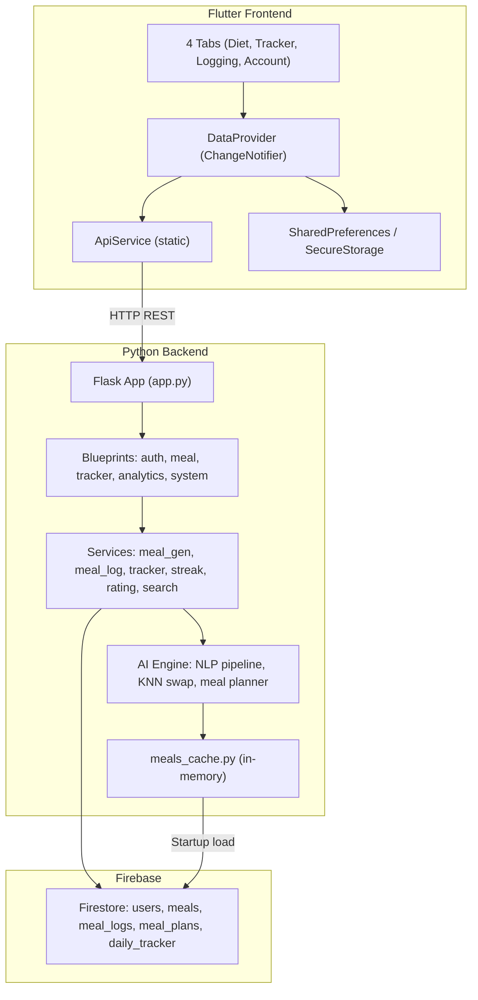

# 🔍 NutriLens — Full System Analysis

## 1. Architecture Map

---

## 2. Current State Assessment

### ✅ What's Already Working Well

| Area | Detail |
|------|--------|
| **Provider** | Already wired via `MultiProvider` in `main.dart` |
| **IndexedStack** | `MainDashboard` already uses `IndexedStack` — tabs are preserved on nav |
| **Deduplication** | `_pendingXxxFetch` futures prevent parallel calls to same endpoint |
| **TTL caching** | Tracker (5 min), DailyRating (5 min), UserProfile (30 min) caches exist |
| **Meal plan persistence** | Cached to `SharedPreferences` with user/date guards |
| **Backend meals cache** | `meals_cache.py` loads once at startup — zero Firestore reads per request for meal data |
| **Selector usage** | `DietTab`, `TrackerTab`, `AccountTab` use `Selector<DataProvider, ViewData>` to avoid full rebuilds |

### ❌ Critical Issues Found

#### SEVERITY: HIGH

| # | Issue | Where | Impact |
|---|-------|-------|--------|
| **H1** | **All data stored as `Map<String, dynamic>`** | `DataProvider` — fields like `dailyTarget`, `mealPlan`, `trackerSummary`, `userProfile`, `streakData`, `dailyRating` | No compile-time safety. Any key typo (`caloreis` vs `calories`) silently returns null. Every widget does unsafe `map['key']` access. |
| **H2** | **TrackerService hits Firestore on EVERY call** | `tracker_service.get_tracker_summary()` → `tracker_repo.get_logs_by_date()` | Each tracker summary = 1 Firestore query (N document reads where N = number of logs). No server-side caching. |
| **H3** | **`get_or_calculate_user_targets()` fetches user doc per tracker call** | `utils/calorie_utils.py` → Firestore `users` collection | Every tracker-summary call reads the user profile from Firestore, even though targets rarely change. |
| **H4** | **`recalculate_daily_tracker` writes to Firestore on every log/swap** | `tracker_service.py:38-62` | Each meal log triggers a full recalculation AND a Firestore write to `daily_tracker_summary` |
| **H5** | **DEMO_MODE is hardcoded `True`** | `meal_routes.py:20` | The `/generate-meal-plan` endpoint NEVER runs the real AI engine — always returns hardcoded plan |

#### SEVERITY: MEDIUM

| # | Issue | Where | Impact |
|---|-------|-------|--------|
| **M1** | **`AccountTab._refreshData` sets `provider.dailyTarget = null` directly** | `account_tab.dart:32` | Breaks encapsulation. Public field mutation without `notifyListeners()`. Other tabs reading `dailyTarget` get stale null. |
| **M2** | **TrackerTab calls `ApiService.updateLog` directly** | `tracker_tab.dart:421-462` | Bypasses `DataProvider`. Inconsistent with DietTab which goes through provider. |
| **M3** | **`logMeal` accepts `dynamic mealNameOrData`** | `data_provider.dart:483-517` | Overloaded function signature — accepts both `String` and `Map<String,dynamic>`. Type-unsafe. |
| **M4** | **No model classes** | Entire frontend | All API responses parsed as raw Maps. No `fromJson`/`toJson`. No IDE autocomplete for data fields. |
| **M5** | **`_analyzeMeal` in LoggingTab uses set literal syntax for map** | `logging_tab.dart:55-62` | `result.map((item) => { 'mealName': ... })` — Dart interprets `{}` as Set, not Map, because of `=>`. This may cause a runtime error or silent data corruption. |

#### SEVERITY: LOW

| # | Issue | Where | Impact |
|---|-------|-------|--------|
| **L1** | **`DietTab._showGreeting` hardcoded 2s timer** | `diet_tab.dart:24-30` | Greeting shows even if data loads instantly. Not tied to actual loading state. |
| **L2** | **Debug `print()` statements everywhere** | `ApiService`, `DataProvider`, `DietTab` | Console noise. `print()` is sync and blocks UI thread in Flutter. Should use `debugPrint`. |
| **L3** | **`_selectedMealType` hardcoded to `'Lunch'` for NLP** | `logging_tab.dart:91` | NLP-logged meals always default to "Lunch" regardless of time of day. |
| **L4** | **Backend `/generate-meal-plan` response inconsistency** | `meal_routes.py` | `_meal_plan_response()` asserts no `data` key, but DEMO_MODE returns both `data.breakfast` AND top-level `breakfast`. Frontend has dual-parsing logic to handle this. |

---

## 3. Data Flow Analysis

### API Surface (Frontend → Backend)

| API | Method | Firestore Reads | Firestore Writes | Notes |
|-----|--------|-----------------|-------------------|-------|
| `/login` | POST | 1 | 0 | User doc lookup |
| `/register` | POST | 0 | 1 | Creates user doc |
| `/calculate-target` | POST | 1 | 0 | Reads user profile to compute TDEE |
| `/generate-meal-plan` | POST | **2-3** (user + cached plan + logs) | 1 (saves new plan) | **Short-circuited by DEMO_MODE** |
| `/log-meal` | POST | 1 (meal lookup) | 1 (creates log) | + triggers `recalculate_daily_tracker` |
| `/tracker-summary` | GET | **1 + N** (user targets + N logs) | 0 | **Biggest Firestore cost** |
| `/generate-daily-rating` | POST | 1 + N | 1 | Reads logs + writes rating |
| `/get-streak` | GET | N | 0 | Reads last 7 days of tracker docs |
| `/replace-meal` | POST | 0-1 | 0 | Uses in-memory cache + KNN |
| `/swap-meal` | POST | 2 | 2 | Reads log, reads meal, updates log, recalculates tracker |
| `/search-food` | GET | 0 | 0 | Uses in-memory cache |
| `/user-profile` | GET | 1 | 0 | Reads user doc |

### Estimated Reads Per Session (single user, one day)

| Event | Calls | Reads per call | Subtotal |
|-------|-------|----------------|----------|
| App start (diet tab) | `ensureHomeTabData()` | profile(1) + target(1) + mealPlan(3) + streak(7) + tracker(1+N) | ~15 |
| Switch to Tracker tab | `fetchTrackerSummary` + `fetchDailyRating` | (1+N) + (1+N) | ~10-20 |
| Log 1 meal | `/log-meal` + `/tracker-summary` refresh | 1 + (1+N) | ~5-8 |
| Swap 1 meal | `/replace-meal` + `/swap-meal` + refresh | 0 + 4 + (1+N) | ~8 |
| Navigate back to Diet | cached (0) | 0 | 0 |
| **Total for typical session** | | | **~40-60 reads** |

With TTL caching on frontend, this is actually reasonable. The **5000 reads/day** you mentioned suggests either:
1. Many users, OR
2. The app was previously not caching (which your DataProvider now fixes), OR
3. The backend tracker service is being hit frequently without server-side caching

---

## 4. Execution Plan — Revised & Prioritized

Based on the analysis, here's the **adjusted** plan (some of your original steps are already done):

| Step | Task | Status | Why |
|------|------|--------|-----|
| ~~Step 4~~ | IndexedStack navigation | ✅ **Already done** | `MainDashboard` uses `IndexedStack` |
| ~~Step 6~~ | Prevent repeated API calls with flags | ✅ **Already done** | `_pendingXxxFetch` + TTL caching |
| ~~Step 5~~ | Frontend caching with SharedPreferences | ✅ **Partially done** | MealPlan + UserProfile cached. Tracker not persisted (by design — stale quickly) |
| **Step 1** | **Typed data models** | 🔴 TODO | Replace all `Map<String,dynamic>` with `Meal`, `MealPlan`, `TrackerSummary`, `UserProfile`, `DailyTarget`, `StreakData`, `DailyRating` |
| **Step 2** | **Refactor DataProvider to use models** | 🔴 TODO | Single source of truth with type-safe fields |
| **Step 3** | **Fix API response normalization** | 🔴 TODO | `ApiService` methods return model objects, not raw maps |
| **Step 7** | **Fix direct field mutation** | 🔴 TODO | `AccountTab` directly sets `provider.dailyTarget = null`. TrackerTab bypasses provider. |
| **Step 8** | **Fix LoggingTab map literal bug** | 🔴 TODO | The `=>` + `{}` syntax issue in `_analyzeMeal` |
| **Step 9** | **Backend: Add server-side tracker caching** | 🔴 TODO | Cache tracker summary in memory for 60s to reduce Firestore reads |
| **Step 10** | **Backend: Cache user targets** | 🔴 TODO | `get_or_calculate_user_targets()` should cache per user |

---

## 5. Ready for Step 1

> [!IMPORTANT]
> Steps 1-3 form a single cohesive unit: **introduce typed data models, update the DataProvider, and update the ApiService**.
> 
> I'll implement them one file at a time, starting with the model classes, to ensure zero breaking changes.

**Awaiting your confirmation to begin Step 1: Create typed data models.**
