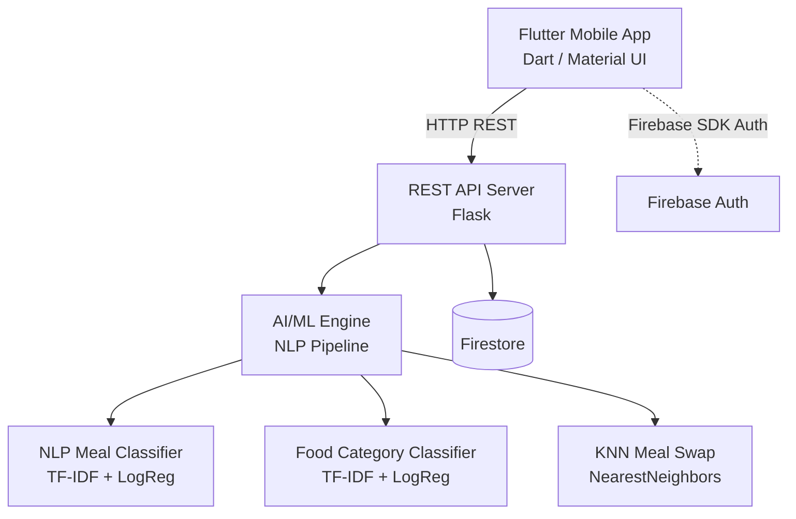
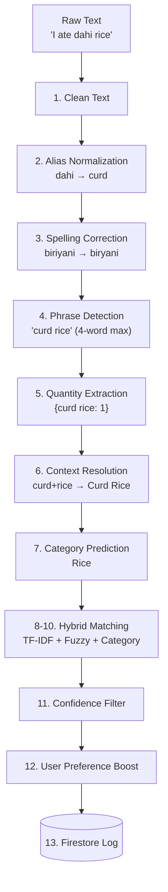
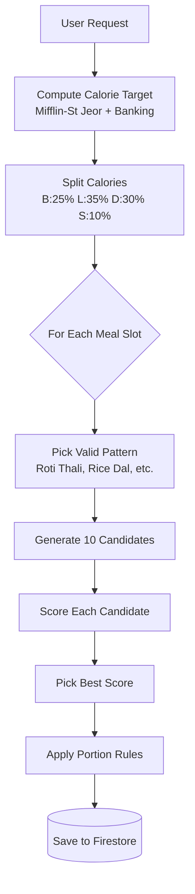
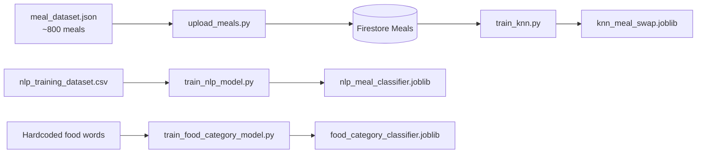

# NutriLens — AI Diet Planner
## Complete Project Architecture Report

---

## 1. Project Overview

NutriLens is an AI-powered diet planning mobile application designed to help users track nutrition, generate personalized meal plans, and log meals using natural language input. The system combines a Flutter mobile frontend with a Python Flask backend, backed by Google Firebase/Firestore for authentication and data storage. It utilizes multiple lightweight Machine Learning (ML) models for intelligent food recognition and dynamic meal planning.

---

## 2. System Architecture



### Architecture Pattern
The project follows a client-server architecture with a microservice-style backend:
- **Client**: Flutter app handles UI, user interactions, and state management.
- **Server**: Flask API handles all business logic, AI processing, and data persistence.
- **Database**: Firestore serves as the cloud NoSQL database for all collections.
- **Models**: Pre-trained scikit-learn models loaded at server startup (cold start optimized).

---

## 3. Technology Stack

### 3.1 Frontend (Contextual)
| Technology | Purpose |
| :--- | :--- |
| **Flutter (Dart)** | Cross-platform mobile framework |
| **Material Design** | UI component library |
| **HTTP package** | REST API communication with backend |
| **Firebase Auth** | User authentication |

### 3.2 Backend
| Technology | Version | Purpose |
| :--- | :--- | :--- |
| **Python** | 3.10+ | Core backend language |
| **Flask** | Latest | Lightweight REST API framework |
| **Flask-CORS** | Latest | Cross-origin request handling |
| **Gunicorn** | Latest | Production WSGI server |
| **firebase-admin** | Latest | Firestore SDK for Python |

### 3.3 AI/ML Libraries
| Library | Purpose |
| :--- | :--- |
| **scikit-learn** | ML model training (TF-IDF, Logistic Regression, KNN) |
| **pandas** | Data manipulation for training datasets |
| **numpy** | Numerical computations |
| **joblib** | Model serialization/deserialization |
| **rapidfuzz** | High-performance fuzzy string matching |

### 3.4 Database & Cloud
| Service | Purpose |
| :--- | :--- |
| **Google Cloud Firestore** | NoSQL document database |
| **Firebase Authentication**| User signup/login |
| **Google Cloud Run** | Container deployment (via Dockerfile) |

### 3.5 Deployment
| Component | Details |
| :--- | :--- |
| **Dockerfile** | `python:3.10-slim` base image |
| **WSGI Server** | Gunicorn on port 8080 |
| **Hosting** | Google Cloud Run (containerized) |

---

## 4. AI/ML Models

The system uses 3 pre-trained machine learning models, all built with `scikit-learn` and serialized using [joblib](file:///d:/NutriLens/backend/models/knn_meal_swap.joblib).

### 4.1 NLP Meal Classifier
| Property | Value |
| :--- | :--- |
| **File** | [models/nlp_meal_classifier.joblib](file:///d:/NutriLens/backend/models/nlp_meal_classifier.joblib) (28.9 MB) |
| **Architecture** | scikit-learn Pipeline: `TF-IDF Vectorizer → Logistic Regression` |
| **Training Script** | [ai/train_nlp_model.py](file:///d:/NutriLens/backend/ai/train_nlp_model.py) |
| **Training Data** | [ai/nlp_training_dataset.csv](file:///d:/NutriLens/backend/ai/nlp_training_dataset.csv) (~694 KB) |
| **Input** | Raw text string (e.g., *"I ate 3 rotis with dal"*) |
| **Output** | Predicted meal name + confidence probability |
| **Features** | TF-IDF with unigrams and bigrams (`ngram_range=(1,2)`), English stopword removal, `min_df=2` |
| **Classifier** | Logistic Regression (`max_iter=2000`) |
| **Evaluation** | 80/20 train-test split with stratified sampling |

**How it works:**
1. User text is lowercased and split by "and" / "," for multi-meal input.
2. Quantity is extracted via regex (`\d+`).
3. Cleaned text is passed to `model.predict_proba()`.
4. The class with the highest probability becomes the predicted meal name.
5. Returns: `[{meal, quantity, confidence}]`

### 4.2 Food Category Classifier
| Property | Value |
| :--- | :--- |
| **File** | [models/food_category_classifier.joblib](file:///d:/NutriLens/backend/models/food_category_classifier.joblib) (2.7 KB) |
| **Architecture** | scikit-learn Pipeline: `TF-IDF Vectorizer → Logistic Regression` |
| **Training Script** | [ai/train_food_category_model.py](file:///d:/NutriLens/backend/ai/train_food_category_model.py) |
| **Training Data** | Hardcoded vocabulary of 13 food words mapped to 6 categories |
| **Input** | Single food word (e.g., *"roti"*, *"dal"*, *"chai"*) |
| **Output** | Category label: Bread, Dal, Rice, Vegetable, Beverage, Dairy |

*Purpose:* Used in the NLP pipeline (Stage 7) to predict the food category of detected entities. This prediction prioritizes candidate filtering — narrowing down Firestore meals to the predicted category before TF-IDF/fuzzy matching.

### 4.3 KNN Meal Swap Model
| Property | Value |
| :--- | :--- |
| **File** | [models/knn_meal_swap.joblib](file:///d:/NutriLens/backend/models/knn_meal_swap.joblib) (446 KB) |
| **Architecture** | `StandardScaler → K-Nearest Neighbors` (k=6, Euclidean distance) |
| **Training Script** | [train_knn.py](file:///d:/NutriLens/backend/train_knn.py) |
| **Training Data** | All meals from Firestore (loaded dynamically) |
| **Feature Vector** | `[calories, protein, carbs, fat]` (4 numerical features) |
| **Input** | A meal dict with nutritional values |
| **Output** | Top-k nutritionally similar meals |

**How it works:**
1. All meals are loaded from Firestore with their 4 macro features.
2. Features are standardized using `StandardScaler` (zero mean, unit variance).
3. A `NearestNeighbors` model is fitted with Euclidean distance.
4. At query time, the input meal's features are scaled and the 5 nearest neighbors are returned.
5. The original meal is excluded from results.

*Use case:* When a user wants to swap a meal in their plan (e.g., replace *"Chicken Biryani"* with something nutritionally similar), the KNN model finds the closest alternatives.

---

## 5. NLP Smart Logger — Hybrid Pipeline (v2.1)

The NLP pipeline is the most sophisticated AI component. It converts natural language food descriptions into structured meal log entries.

### 5.1 Pipeline Architecture



### 5.2 Pipeline Stages in Detail

| Stage | Module | Algorithm | Purpose |
| :--- | :--- | :--- | :--- |
| **1** | [text_preprocessor.py](file:///d:/NutriLens/backend/ai/text_preprocessor.py) | Regex + stopword list | Lowercase, remove punctuation, strip stopwords |
| **2** | [text_preprocessor.py](file:///d:/NutriLens/backend/ai/text_preprocessor.py) | Dictionary lookup (35+ aliases)| Normalize regional names: dahi→curd, bhindi→okra |
| **3** | [text_preprocessor.py](file:///d:/NutriLens/backend/ai/text_preprocessor.py) | RapidFuzz ratio (threshold=85) | Correct misspellings against food vocabulary |
| **4** | [phrase_detector.py](file:///d:/NutriLens/backend/ai/phrase_detector.py) | Greedy sliding window (4→3→2) | Detect multi-word entities: *"paneer butter masala"* |
| **5** | [quantity_extractor.py](file:///d:/NutriLens/backend/ai/quantity_extractor.py) | Regex + word-number map | Extract quantities: digits, fractions, word numbers |
| **6** | [context_resolver.py](file:///d:/NutriLens/backend/ai/context_resolver.py) | Rule-based pair matching | Detect combos: dal+rice → Dal Chawal with score boost |
| **7** | [food_category_model.py](file:///d:/NutriLens/backend/ai/food_category_model.py)| TF-IDF + Logistic Regression | Predict food category for candidate filtering |
| **8** | [tfidf_matcher.py](file:///d:/NutriLens/backend/ai/tfidf_matcher.py) | TF-IDF cosine similarity | Semantic matching against meal database |
| **9** | [hybrid_matcher.py](file:///d:/NutriLens/backend/ai/hybrid_matcher.py) | RapidFuzz `partial_ratio` | Fuzzy string matching against names + keywords |
| **10** | [hybrid_matcher.py](file:///d:/NutriLens/backend/ai/hybrid_matcher.py) | Weighted formula | `0.55×tfidf + 0.25×fuzzy + 0.10×category + 0.10×context` |
| **11** | [hybrid_matcher.py](file:///d:/NutriLens/backend/ai/hybrid_matcher.py) | Threshold filter | Discard if tfidf < 0.35 AND fuzzy < 0.65 |
| **12** | [nlp_pipeline.py](file:///d:/NutriLens/backend/ai/nlp_pipeline.py) | Firestore query (last 30 logs) | Boost confidence for frequently logged meals |
| **13** | [nlp_pipeline.py](file:///d:/NutriLens/backend/ai/nlp_pipeline.py) | Firestore write | Log to `meal_logs` + `nlp_debug_logs` collections |

### 5.3 Hybrid Scoring Formula
```text
final_score = 0.55 × TF-IDF_similarity
            + 0.25 × fuzzy_score
            + 0.10 × category_match (1.0 or 0.0)
            + 0.10 × context_score  (1.0 or 0.0)
```
*Adaptive behavior:* When `tfidf > 0.8`, the category weight drops to 0 and is redistributed to TF-IDF (prevents category noise from penalizing strong semantic matches).

### 5.4 Performance Optimization
All expensive objects are computed once at server cold start and cached in module-level globals:
- TF-IDF vectorizer and pre-computed matrix ([tfidf_matcher.py](file:///d:/NutriLens/backend/ai/tfidf_matcher.py))
- Phrase detection set ([phrase_detector.py](file:///d:/NutriLens/backend/ai/phrase_detector.py))
- Spelling correction vocabulary ([text_preprocessor.py](file:///d:/NutriLens/backend/ai/text_preprocessor.py))
- Food category classifier model ([food_category_model.py](file:///d:/NutriLens/backend/ai/food_category_model.py))

---

## 6. Meal Plan Generator (v2)

The meal plan generator creates personalized daily meal plans using a pattern-based algorithm with compatibility scoring.

### 6.1 Generation Pipeline



### 6.2 Calorie Target Calculator
| Component | Algorithm |
| :--- | :--- |
| **BMR** | Mifflin-St Jeor equation: `10×weight + 6.25×height − 5×age ± constant` |
| **TDEE** | BMR × activity_factor (1.2 to 1.9) |
| **Goal** | TDEE + goal_modifier (−500 lose, 0 maintain, +500 gain) |
| **Macro Split** | 25% protein, 45% carbs, 30% fat |
| **Calorie Banking** | 3-day adaptive adjustment (±150 kcal max) based on consumption history |

### 6.3 Meal Pattern System
*14 realistic meal patterns define the structure of each meal:*

| Pattern | Slots | Example |
| :--- | :--- | :--- |
| `Roti_Thali` | main(grain) + protein + vegetable + dairy(opt) | 3 roti + dal + sabzi + curd |
| `Rice_Dal_Meal` | main(grain) + protein + vegetable(opt) + dairy(opt) | rice + dal + sabzi |
| `South_Indian_Breakfast`| main(grain) + side + drink(opt) | 2 idli + sambar + chutney |
| `One_Pot_Meal` | main + condiment(opt) | biryani + raita |
| `Roti_Curry_Light` | main(grain) + protein + vegetable(opt) | 2 roti + paneer curry |
| `Light_Snack` | main + drink(opt) | banana + chai |

### 6.4 Compatibility Scoring
Every candidate combination is scored using:
| Signal | Examples | Weight |
| :--- | :--- | :--- |
| **Pair compatibility** | roti+dal: +3, idli+sambar: +3, biryani+raita: +3 | Pair-wise |
| **Pair penalty** | dosa+roti: −4, biryani+naan: −3, rice+roti: −3 | Pair-wise |
| **Collision penalty** | Multiple carb bases: −5 each, multiple heavy dishes: −5 each | Per violation |
| **Calorie fit** | Within 20% of target: +2, beyond 40%: −2 | Per meal |
| **Variety penalty** | Meal appeared in last 3 days: −3 per occurrence | Per item |

### 6.5 Portion Rules
| Food Type | Default Quantity | Range |
| :--- | :--- | :--- |
| **Roti / chapati** | 2 | 2–4 |
| **Rice** | 1 | 1 |
| **Dal / curry** | 1 bowl | 1 |
| **Sabzi / vegetable**| 1 bowl | 1 |
| **Curd / raita** | 1 | 1 |
| **Drinks** | 1 | 1 |
| **Snack items** | 1 | 1–2 |

### 6.6 Derived Tag System
*Each meal in the database is auto-classified into a derived tag:*

| Derived Tag | Examples |
| :--- | :--- |
| `carb_base` | roti, rice, dosa, idli, naan, pasta |
| `protein_curry` | dal, paneer curry, chicken curry |
| `dry_sabzi` | aloo gobi, bhindi fry |
| `heavy_dish` | biryani, butter chicken, korma |
| `condiment` | chutney, pickle, raita, curd |
| `drink` | chai, lassi, buttermilk |

---

## 7. Semantic Tagging System

Each meal in Firestore has 3 semantic tags assigned by the rule-based [tag_meals.py](file:///d:/NutriLens/backend/tag_meals.py) script.

### 7.1 Tag Types
| Tag | Values | Method |
| :--- | :--- | :--- |
| `cuisine` | north_indian, south_indian, western, chinese, middle_eastern | Keyword matching on meal name + keywords |
| `food_group` | grain, protein, vegetable, dairy, fruit | Priority-based keyword matching |
| `meal_role` | main, side, drink | Context-based classification |

### 7.2 Tagging Logic
The [tag_meals.py](file:///d:/NutriLens/backend/tag_meals.py) script uses a rules engine with keyword-based classification:
- **Cuisine**: checks for cuisine-specific keywords (e.g., "dosa"/"idli" → south_indian, "roti"/"naan" → north_indian).
- **Food group**: priority order: dairy > protein > vegetable > grain (with special handling for paneer as protein).
- **Meal role**: drinks identified by liquid keywords, sides by accompaniment keywords, everything else defaults to main.

---

## 8. API Endpoints

The Flask backend exposes 18 REST API endpoints:

### 8.1 Authentication
| Method | Endpoint | Purpose |
| :--- | :--- | :--- |
| `POST` | `/register` | User registration with email/password |
| `POST` | `/login` | User authentication |

### 8.2 Core Features
| Method | Endpoint | Purpose |
| :--- | :--- | :--- |
| `POST` | `/calculate-target` | Compute daily calorie/macro targets |
| `POST` | `/generate-meal-plan` | Generate AI-powered daily meal plan |
| `POST` | `/log-meal` | Manual meal logging |
| `POST` | `/log-meal-nlp-ml` | AI-powered natural language meal logging |
| `POST` | `/replace-meal` | Replace a meal in the plan |
| `POST` | `/swap-meal` | KNN-powered intelligent meal swap |

### 8.3 Data Retrieval
| Method | Endpoint | Purpose |
| :--- | :--- | :--- |
| `GET` | `/user-profile` | Fetch user profile data |
| `GET` | `/tracker-summary` | Daily nutrition tracking summary |
| `GET` | `/get-meal-plans` | Fetch user's meal plans |
| `GET` | `/get-analytics` | Fetch analytics data |
| `GET` | `/get-daily-ratings` | Fetch daily rating history |

### 8.4 Analytics & Feedback
| Method | Endpoint | Purpose |
| :--- | :--- | :--- |
| `POST` | `/generate-daily-rating` | AI-generated daily nutrition rating |
| `POST` | `/recalculate-analytics`| Recompute analytics from logs |
| `POST` | `/submit-feedback` | User feedback submission |

### 8.5 Utility
| Method | Endpoint | Purpose |
| :--- | :--- | :--- |
| `GET` | `/` | Health check |
| `GET` | `/routes`| List all available routes |

---

## 9. Database Schema (Firestore)

### 9.1 Key Collections
| Collection | Documents | Purpose |
| :--- | :--- | :--- |
| `users` | ~N users | User profiles with health/dietary info |
| [meals](file:///d:/NutriLens/backend/services/meal_generator_service.py#109-116) | ~600-900 | Indian meal database with nutrition data |
| `meal_plans` | Per user per day | Generated daily meal plans (stores meal IDs) |
| `meal_logs` | Per meal logged | Individual meal log entries |
| `daily_targets`| Per user per day | Computed calorie/macro targets |
| `nlp_debug_logs`| Per NLP request | Debug traces of the NLP pipeline |

---

## 10. Data Pipeline



**Meal Dataset Workflow**:
- **Source**: [meal_dataset.json](file:///d:/NutriLens/backend/meal_dataset.json) (669 KB, ~800 Indian meals)
- **Upload**: [upload_meals.py](file:///d:/NutriLens/backend/upload_meals.py) bulk-loads meals to Firestore
- **Tagging**: [tag_meals.py](file:///d:/NutriLens/backend/tag_meals.py) adds `cuisine`, `food_group`, `meal_role` tags
- **Fields per meal**: `mealName`, `searchKeywords`, `category`, `calories`, `protein`, `carbs`, `fat`, `portionSize`, `validMealTypes`

---

## 11. Project File Structure
```text
nutrilens-backend/
├── app.py                          # Flask API server
├── Dockerfile                      # Container config (Python 3.10-slim + Gunicorn)
├── requirements.txt                # Python dependencies
├── serviceAccountKey.json          # Firebase credentials
├── meal_dataset.json               # Raw meal database
├── upload_meals.py                 # Firestore bulk upload script
├── tag_meals.py                    # Semantic tag assignment script
├── train_knn.py                    # KNN model training script
│
├── ai/                             # AI/ML Engine
│   ├── nlp_pipeline.py             # 12-stage NLP orchestrator
│   ├── text_preprocessor.py        # Text cleaning + aliases + spelling
│   ├── phrase_detector.py          # Multi-word phrase detection
│   ├── quantity_extractor.py       # Quantity/portion extraction
│   ├── context_resolver.py         # Food combo detection + scoring
│   ├── tfidf_matcher.py            # TF-IDF semantic matching
│   ├── hybrid_matcher.py           # Hybrid scoring engine
│   ├── food_category_model.py      # Category classifier wrapper
│   ├── meal_plan_generator.py      # Pattern-based meal plan generator
│   ├── meal_patterns.py            # Meal patterns + portion rules
│   ├── compatibility_scorer.py     # Pair-wise food compatibility
│   └── smart_swap_knn.py           # KNN meal swap engine
│
├── models/                         # Serialized ML models
│   ├── nlp_meal_classifier.joblib  
│   ├── food_category_classifier.joblib  
│   └── knn_meal_swap.joblib        
│
└── tests/                          # Unit + integration tests
```

---

## 12. Testing

| Test File | Tests | Coverage |
| :--- | :--- | :--- |
| `test_nlp_pipeline.py` | 36 | Text preprocessing, aliases, phrases, quantities, context, TF-IDF, hybrid matching |
| `test_meal_generator.py` | 19 | Patterns, scoring, collisions, plan generation, variety, portions |
| `test_meal_logic_v2.py` | 3 | Cuisine consistency, quantities, plan structure |
| `test_api_integration.py`| 1 | End-to-end API test (requires running server) |
| `test_routes.py` | 3 | Route registration verification |
| **Total** | **62** | |

---

## 13. Key Algorithms Summary

| Algorithm | Library | Used In |
| :--- | :--- | :--- |
| **TF-IDF Vectorization** | `scikit-learn` | NLP pipeline (semantic matching), NLP classifier, category classifier |
| **Logistic Regression** | `scikit-learn` | NLP meal classifier, food category classifier |
| **K-Nearest Neighbors** | `scikit-learn` | Smart meal swap |
| **Cosine Similarity** | `scikit-learn` | TF-IDF meal matching |
| **Fuzzy String Matching** | `rapidfuzz` | NLP pipeline (fuzzy matching stage) |
| **Mifflin-St Jeor Equation**| Custom | Calorie target calculation |
| **Compatibility Scoring** | Custom | Meal plan generator (pair rules + collision detection) |
| **Greedy Longest Match** | Custom | Multi-word phrase detection |

---

## 14. Security & Performance

**Security**
- Passwords stored as Werkzeug-generated hashes (not plaintext).
- Firebase service account key for backend auth.
- Flask-CORS enabled for cross-origin mobile requests.

**Performance Optimization**
- All ML models loaded once at cold start and cached in memory.
- TF-IDF matrix pre-computed at startup.
- NLP vocabulary and phrase sets built once and reused.
- Firestore queries use `.limit()` to cap read operations.
- KNN model uses `StandardScaler` for consistent feature scaling.
- 10-candidate meal generation is bounded (not exhaustive search).
